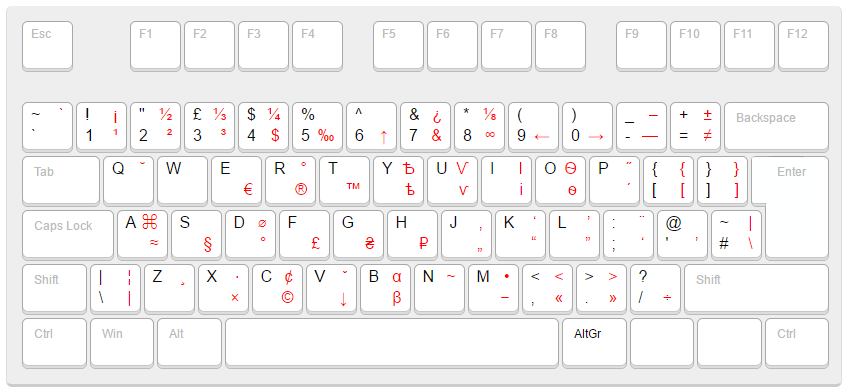

# Раскладки Бирмана для Arch Linux

Типографские раскладки Ильи Бирмана для клавиатуры — английская и русская — с установщиком для **Arch Linux + KDE Plasma 6 + Wayland**.

Раскладки добавляют типографские символы (кавычки «», тире —, многоточие …, стрелки →, знак торговой марки ™ и другие) через правый Alt (AltGr).



## Требования

| Компонент    | Описание                                         |
|--------------|--------------------------------------------------|
| Arch Linux   | Пакетный менеджер `pacman`                       |
| KDE Plasma 6 | `plasmashell`, `kwriteconfig6` (пакет `kconfig`) |
| Wayland      | Рекомендуется; X11 работает с предупреждением    |
| Python 3     | Для вспомогательных скриптов                     |

## Установка

```bash
git clone https://github.com/<your-username>/birman-layout-for-arch-linux.git
cd birman-layout-for-arch-linux
./install-arch.sh
```

Скрипт выполняет следующее:

1. Добавляет XKB-блоки `typo-birman-en` и `typo-birman-ru` в системные файлы символов.
2. Регистрирует варианты раскладок в `evdev.lst` и `evdev.xml`.
3. Настраивает `~/.config/kxkbrc` (создаёт резервную копию существующего файла).
4. Предлагает назначить `Alt+Shift` для переключения раскладок.
5. Перезагружает KWin.

После установки новые раскладки появятся в системном трее. Если этого не произошло — выйдите из системы и войдите снова.

### Pacman-хук (защита от обновлений)

Пакет `xkeyboard-config` перезаписывает системные XKB-файлы при обновлении. Чтобы раскладки не слетали после `pacman -Syu`:

```bash
# Копировать файлы раскладок в системный каталог
sudo install -dm755 /usr/local/share/birman-xkb
sudo cp -r symbols rules helper /usr/local/share/birman-xkb/

# Установить хук и скрипт восстановления
sudo install -Dm644 hooks/99-birman-xkb.hook /etc/pacman.d/hooks/99-birman-xkb.hook
sudo install -Dm755 hooks/birman-xkb-reapply.sh /usr/local/bin/birman-xkb-reapply
```

После этого при каждом обновлении `xkeyboard-config` раскладки будут применяться автоматически.

## Удаление

```bash
./uninstall-arch.sh
```

Скрипт удаляет XKB-блоки, очищает `evdev.lst` и `evdev.xml`, восстанавливает `kxkbrc` из резервной копии (или сбрасывает к значениям по умолчанию), опционально удаляет pacman-хук и системные файлы.

## Структура репозитория

```
.
├── install-arch.sh           # Установщик для KDE Plasma 6 + Wayland
├── install.sh                # Установщик для GNOME (устаревший)
├── uninstall-arch.sh         # Удаление для KDE
├── symbols/
│   ├── typo-birman-en        # XKB-блок английской раскладки
│   └── typo-birman-ru        # XKB-блок русской раскладки
├── rules/
│   ├── variant_en            # XML-фрагмент для evdev.xml (EN)
│   └── variant_ru            # XML-фрагмент для evdev.xml (RU)
├── helper/
│   ├── xmladd.py             # Добавляет варианты в evdev.xml
│   ├── xmlremove.py          # Удаляет варианты из evdev.xml
│   └── symbolsremove.py      # Удаляет блоки из файлов символов XKB
├── hooks/
│   ├── 99-birman-xkb.hook    # Триггер pacman-хука
│   └── birman-xkb-reapply.sh # Скрипт повторного применения раскладок
└── _keyboard/
    ├── index.html            # Интерактивная схема раскладки
    └── snapshot.png          # Скриншот раскладки
```

## GNOME

Для GNOME используйте `install.sh` — он применяет настройки через `gsettings`. Скрипт удаления для GNOME в репозитории не предусмотрен.

## Автор раскладок

[Илья Бирман](https://ilyabirman.ru/typography-layout/) — дизайнер и типограф, автор оригинальных раскладок.
